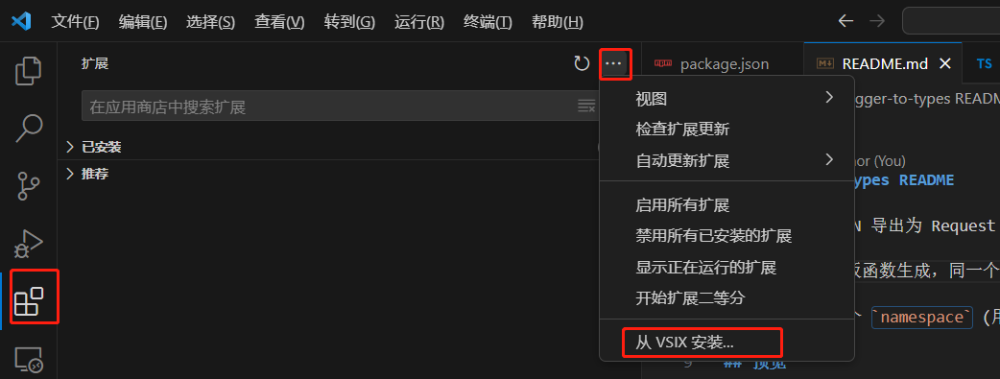
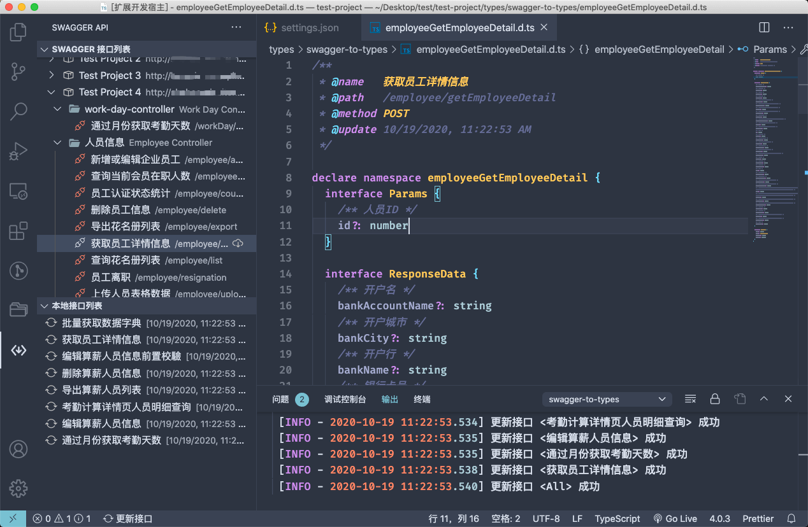

# swagger-to-types README

将 Swagger JSON 导出为 Request & Typescript interface

请求函数基于模板函数生成，同一个服务的请求生成一个api文件。在调用请求时使用快捷键 `Shift + Alt + Q` 自动填充请求参数.

每个接口生成一个 `namespace` (用于分组,避免重名), 包含 `Params`, `Response`, 每一个 DTO 都能生成独立的 `interface`.

## 安装
目前该扩展插件暂不支持从vscode扩展商店安装。但可使用Release中的[.vsix安装包](https://github.com/luofc21/vscode-swagger-generate-api/releases/tag/v2.0.0-alpha)完成插件安装.


## 预览



## Config

| 名称                                         | 说明                                                               | 类型                                        | 默认                                          |
| -------------------------------------------- | ------------------------------------------------------------------ | ------------------------------------------- | --------------------------------------------- |
| swaggerGenerateApi.swaggerJsonUrl            | Swagger API 列表                                                   | [SwaggerJsonUrlItem](#SwaggerJsonUrlItem)[] | []                                            |
| swaggerGenerateApi.swaggerJsonHeaders        | 追加请求头 (全局)                                                  | object                                      | {}                                            |
| swaggerGenerateApi.savePath                  | `.d.ts` 接口文件保存路径                                           | string                                      | 'types/swagger-interfaces'                    |
| swaggerGenerateApi.requestSavaPath           | 请求文件保存路径                                                   | string                                      | 'src/api'                                     |
| swaggerGenerateApi.requestHeaderDoc          | 在请求文件中添加额外代码                                           | string                                      | 'import { get, post } from "@/utils/request"' |
| swaggerGenerateApi.showStatusbarItem         | 显示状态栏按钮                                                     | boolean                                     | `true`                                        |
| swaggerGenerateApi.compareChanges            | 是否在更新接口时比对更改 (无更改不更新)                            | boolean                                     | `true`                                        |
| swaggerGenerateApi.reloadWhenSettingsChanged | 当用户设置更改时重新加载数据. (在某些频繁刷新设置的情况下需要关闭) | boolean                                     | `true`                                        |

## SwaggerJsonUrlItem

| 属性            | 说明                               | 类型   | 是否必填           |
| --------------- | ---------------------------------- | ------ | ------------------ |
| title           | 项目标题                           | string | :heavy_check_mark: |
| url             | swagger json url                   | string | :heavy_check_mark: |
| link            | 在浏览器打开外部链接               | string |                    |
| basePath        | 服务地址                           | string | :heavy_check_mark: |
| headers         | 自定义请求头信息 (如鉴权 Token 等) | object |                    |
| savePath        | `.d.ts` 文件保存路径               | string |                    |
| requestSavePath | 请求文件保存路径                   | string |                    |

## 保存请求函数

配置一个请求函数模板用于生成请求函数

创建 `.vscode/swagger-to-types.template.cjs` 文件

编写并导出 `saveRequest` 函数，即可使用此功能

相关按钮将出现在这几个位置：

- Swagger接口列表操作按钮
- `.d.ts` 文件 标题栏操作按钮
- `.d.ts` 文件 代码行首文字按钮

下面是一个例子：

```js
/**
 * 请求函数模板
 *
 * @param {{
*  type: string
*  basePath: string
*  groupName: string
*  method: string
*  params: object
*  paramsDesc: string
*  response: TreeInterfacePropertiesItem | TreeInterfacePropertiesItem[] | string
*  title: string
*  path: string
*  subTitle: string
*  pathName: string
*  fileName: string
*  operationId: string
*  savePath: string
* }} treeInterface
* @returns
*/
function saveRequest(treeInterface) {

  return [
    `/**
  * @name ${treeInterface.title}
  * @params ${treeInterface.paramsDesc} 
  */`,
    `export const ${treeInterface.pathName} = (params) => ${treeInterface.method}(\`${treeInterface.path}\`, ${treeInterface.params}, { serverName })`,
  ]
}

/**
 * 请求函数模板（TS）
*/
function saveRequestTS(treeInterface) {
  return [
    `/**
    * @name ${treeInterface.title}
    * @params ${treeInterface.paramsDesc} 
    */`,
    `export const ${treeInterface.pathName} = (params: ${treeInterface.pathName}.Params) => 
      ${treeInterface.method}<${treeInterface.pathName}.ResponseData>(\`${treeInterface.path}\`, ${treeInterface.params}, { serverName })`,
  ]
}

module.exports = { saveRequest, saveRequestTS }
```

以下为可选配置：

## 忽略一键更新

在 `.d.ts` 文件头部注释中添加 `@ignore` 标识, 可以在一键更新本地接口时忽略当前文件.

```ts
/**
 * @name   示例接口
 * @path   /demo/demo-api
 * @method POST
 * @update 10/19/2020, 11:22:53 AM
 * @ignore
 */
```

## Interface 模板

用于在某些特殊场景下定制产出的内容格式。

| 方法名       | 参数                                       | 返回值             |
| ------------ | ------------------------------------------ | ------------------ |
| namespace    | TreeInterface                              | string             |
| params       | TreeInterface                              | string             |
| paramsItem   | TreeInterfacePropertiesItem, TreeInterface | string             |
| response     | TreeInterface                              | string             |
| responseItem | TreeInterfacePropertiesItem, TreeInterface | string             |
| saveRequest  | FileHeaderInfo                             | string \| string[] |

详细类型参考 [TemplateBaseType](src/tools/get-templates.ts#L11)

#### 示例: 添加分组前缀

编辑 `.vscode/swagger-to-types.template.cjs` 文件。

> ⚠️⚠️⚠️ 注意: 若所在项目的 `package.json` 存在 `"type": "module",` 字段，模板配置文件必须为 `.cjs` 后缀，否则插件无法正常工作。

```js
function namespace(params) {
  return `${params.groupName.replace(/[\-\n\s\/\\]/g, '_')}_${params.pathName}`
}

module.exports = { namespace }
```

#### 示例: 将字段名转化为大驼峰

编辑 `.vscode/swagger-to-types.template.js` 文件

```js
/**
 * 首字母大写
 * @param {String} str
 */
function toUp(str) {
  if (typeof str !== 'string') return ''
  return str.slice(0, 1).toUpperCase() + str.slice(1)
}

function paramsItem(item, params) {
  // 项目标题(swaggerGenerateApi.swaggerJsonUrl[number].title) 为 demo-1 时忽略定制方案
  if (params.groupName === 'demo-1') return

  return `${toUp(item.name)}${item.required ? ':' : '?:'} ${item.type}`
}

module.exports = { paramsItem }
```

## 注意

- 支持 swagger v2 API
- 支持 openapi 3.0.0
- 请不要对模板处理函数的参数直接进行赋值操作，这可能产生破坏性影响。
